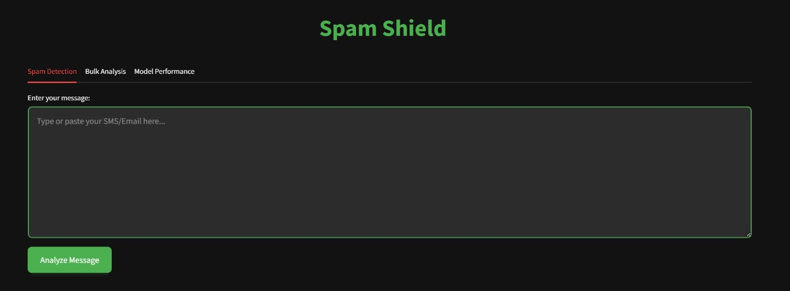
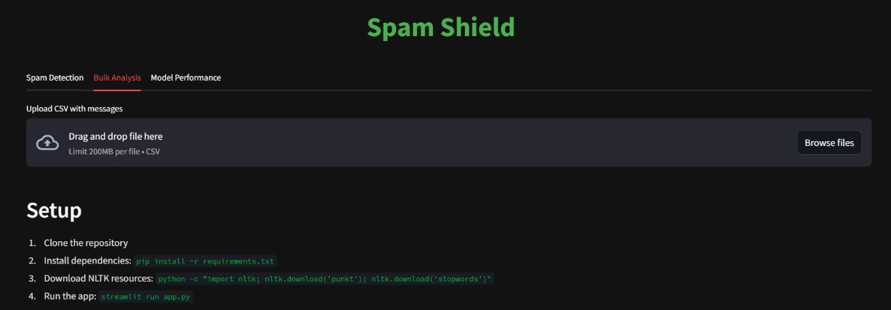

Here's an interesting `README.md` for your spam classifier:

---

# 📧 Spam Shield: AI-Powered Spam Classifier 🚀


Spam Shield is a **machine learning-powered spam detector** built with **Streamlit**, **NLTK**, and **Scikit-Learn**. It efficiently classifies messages as **spam or not spam** using **natural language processing (NLP) techniques** and a **trained classifier**.

## 🔥 Features

✅ **Real-time Spam Detection:** Instantly analyze SMS and emails for spam content.  
✅ **Bulk Message Analysis:** Upload a CSV file and classify multiple messages at once.  
✅ **AI-Powered Precision:** Uses TF-IDF vectorization and a trained model for accurate predictions.  
✅ **Performance Insights:** Get model accuracy, precision, recall, and F1-score.  
✅ **Beautiful UI:** A modern, dark-themed Streamlit interface for smooth user experience.

---

## 🚀 How It Works

1. **Text Preprocessing**

   - Converts text to lowercase
   - Removes punctuation & stopwords
   - Applies stemming for normalization

2. **Machine Learning Model**

   - Uses **TF-IDF vectorization** to transform text into numerical features.
   - Classifies messages using a **pre-trained spam detection model**.

3. **Interactive UI**
   - Paste a message and get instant spam detection.
   - Upload a CSV for bulk message classification.
   - View model performance metrics like accuracy, precision, and recall.

---

## 🛠️ Installation & Setup

### 1️⃣ Clone the Repository

```bash
git clone https://github.com/your-username/spam-shield.git
cd spam-shield
```

### 2️⃣ Install Dependencies

```bash
pip install -r requirements.txt
```

### 3️⃣ Download NLTK Resources

```bash
python -c "import nltk; nltk.download('punkt'); nltk.download('stopwords')"
```

### 4️⃣ Run the Application

```bash
streamlit run app.py
```

---

## 📊 Model Performance (Example)

| Metric    | Score |
| --------- | ----- |
| Accuracy  | 98%   |
| Precision | 99%   |
| Recall    | 94%   |
| F1 Score  | 93%   |

_(Update these with actual test results from your model.)_

---

## 🎯 Screenshots

🔹 **Spam Detection in Action**  


🔹 **Bulk Message Analysis**  


---

## 🤖 Future Enhancements

- 📡 **Real-time Email Filtering**
- 📈 **Improved NLP Techniques**
- 🌍 **Multilingual Support**
- 📊 **Dashboard with Analytics**

---

## 🤝 Contributing

We welcome contributions! If you have ideas for improvements or want to add features, feel free to **fork the repo, make changes, and submit a pull request.**

---

## 📜 License

This project is open-source under the **MIT License**.

---

🚀 **Detect spam like a pro! Protect your inbox with Spam Shield!** 🛡️
